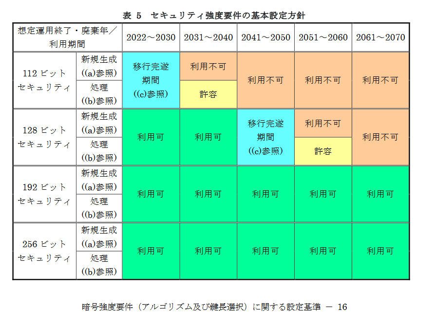

# Backup System

## 要件

* バックアップを自動的 or 手軽に行えること。
* 暗号化を施し、クラウドストレージと同期できること。
* 要所で破損確認が走ること。
  * できればファイル分割

## ディレクトリ構造

* /
  * repo.toml
    * ルート情報ファイル (兼ロック？)
  * inbox/
    * `prefix_date.tar.xz`
    * `prefix_date.tar.xz.md5sum`
  * repo/
    * `prefix`/
      * `prefix_date.tar.xz` etc.
      * ...
    * `prefix2`/
      * ...
  * crypt/
    * `prefix_date`/
      * `prefix_date.tar.xz.00000`
      * `prefix_date.tar.xz.00001`
      * ...

## 暗号関連

### 暗号化・復号

* 暗号化方式: AES-256
  * 共通鍵暗号
  * 128 bit (16 byte) ブロック暗号
* 暗号化モード: GCM
  * 認証付き (改ざん検知がついているので自動的にファイル破損検出も可能)

暗号化時のパラメータ

* 暗号鍵 (復号鍵と共通)
  * 鍵長: 256 bit (32 byte)
* nonce
  * 96 bit (12 byte)
  * 毎回新規に生成しなければならない。
  * IV (Initialize Vector) の一部に使っているっぼい。
    確かに nonce という名前の方が毎回生成しないといけないっぽさがあってよいかも。
  * 暗号化データと共に保存する。
* AAD
  * Additional Authenticated Data
  * 0 byte 以上の任意長のデータ
  * 平文の追加情報データに対して、暗号・復号とは別に改ざん検知のみ行う機能らしい。
* input
  * 任意長
  * 暗号化する平文データ

暗号化時の結果

* output
  * 長さは input と同じ
* tag
  * 認証データ (改ざん・破損検知に使用)
  * 128 bit (16 byte)
  * output と共に保存する。

### 鍵導出

パスワードはエントロピーが低すぎるので暗号化の鍵に使う前にもうちょっと
何とかした方がよい。

* 共通鍵を乱数で生成してローカルに保存、クラウドストレージには置かない
  * 鍵をハードウェアごと失うとクラウド上のデータが復号不能のジャンクデータになる。
  * 許容できない。
* 共通鍵もクラウドストレージに置く
  * こんな厳重な暗号をかけておいて意味が分からないと言えなくもないが、
    検閲回避が目的なのでこれで十分とも言える。
* パスワードから共通鍵を導出する
  * 総当たり攻撃や辞書攻撃への耐性が不安だが、今回の用途に限っては、
    人に認証情報を持たせるという意味で結局これなのかもしれない。
  * <https://github.com/openssl/openssl/blob/master/doc/man3/EVP_BytesToKey.pod>
  * openssl で暗号化にパスワードを使う時に変換に使われる関数。
  * パスワードにソルトを連結し、ハッシュ関数を何回かかける。
    ハッシュアルゴリズム固有のハッシュサイズのデータが得られるので、
    鍵と IV (nonce) として左の方から切り出して使う。
* openssl デフォルトの上記の方法は警告が出る。
  * `-iter` や `-pbkdf2` を使えと言われる。
* パスワードをハッシュ化してファイルやデータベースに保存する場合、
  bcrypt というアルゴリズムが標準的 (現 PHP 推奨)。
  * ハッシュ関数に blowfish (これ自体は微妙だが、わざと重いものを使う)、
    初期データになんかよく分からない固定文字列を使用、
    ハッシュ回数 (ストレッチング回数) を多くできるようにしたもの。
  * ハッシュの総当たりはメモリ/ストレージへのメモ化をうまくやる
    レインボーテーブルがよく行われてきており、ソルトがよく効く。
  * ただし最近は GPU による並列総当たりの方が脅威。
  * pbkdf2 も似たような感じだが、計算が軽くて
* 要は、ソルトを入れることと、ハッシュの適用回数を増やすこと、
  ハッシュ関数も計算時間が長くメモリ使用量の多い ~~クソ~~ アルゴリズムを
  使用するのがポイント。
* ハッシュの総当たりを GPU 並列化で強行突破するのは暗号資産の採掘でやっていること
  そのものなので、つまりそういうこと。
* ASIC (ハードウェアチップ自作、FPGA でもないガチのやつ) で速度と電力効率を
  限界まで高めて暗号資産を採掘しているので、ついでにパスワードハッシュも
  危険に晒されているという恰好。
* `pbkdf2` < `bctypt` < `scrypt` < `argon2` らしい？
  * pbkdf2 はハッシュ関数が選択可能だが、SHA256 等計算時間の短い高性能な
    ハッシュ関数を使うと微妙らしい。。ハッシュ適用回数を増やす必要がある。
  * ただしアメリカ NIST 策定のセキュリティ要件 FIPS 140 を満たすには pbkdf2 が必要。
* 結局専用 ASIC とか、国家レベルを相手にするのでなければそれらしくソルトを
  ちゃんと入れてそれなりの回数ストレッチングをすればよい。
  国家権力にパスワードとかいうエントロピー不足の欠陥システムで立ち向かおうとする方が
  おかしい。嫌ならパスワードを使うな。

<https://cheatsheetseries.owasp.org/cheatsheets/Password_Storage_Cheat_Sheet.html>

### 参考にしたデータ

CRYPTREC暗号リスト (電子政府推奨暗号リスト)

<https://www.cryptrec.go.jp/list.html>

<https://github.com/RustCrypto/>

<https://github.com/RustCrypto/hashes?tab=readme-ov-file#crate-names>

MD5 のクレート名に関する注意:
`md5` のオーナが RustCrypto プロジェクトへの参加を拒否した。
`md-5` の名前で RustCrypto スタイルの実装が公開されているのでそちらを使うこと。

